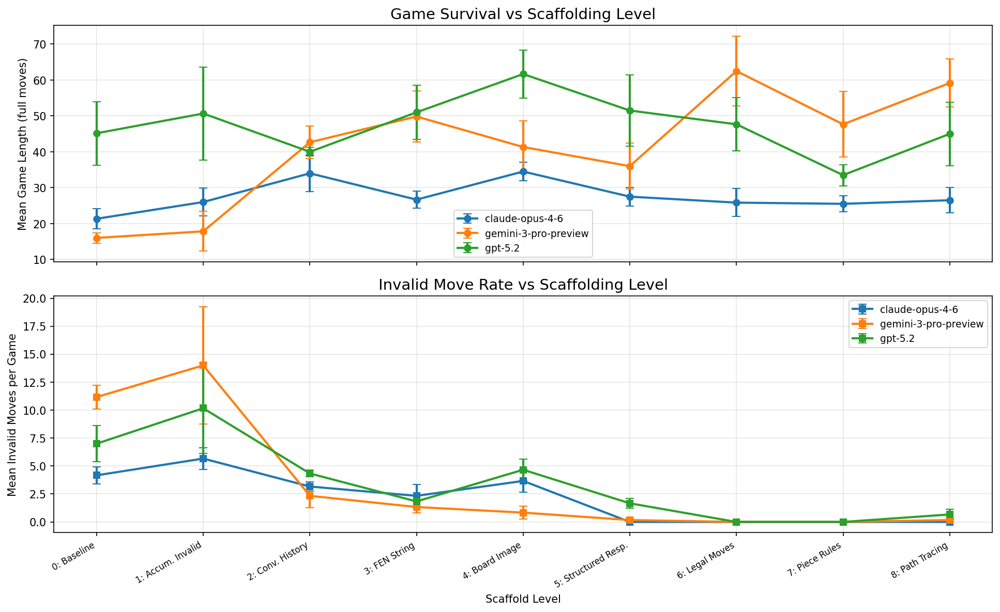
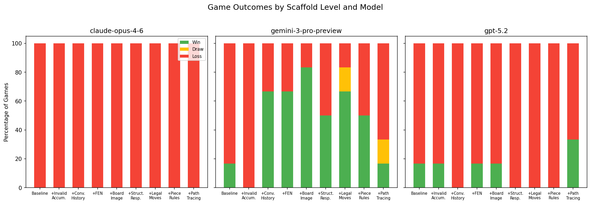
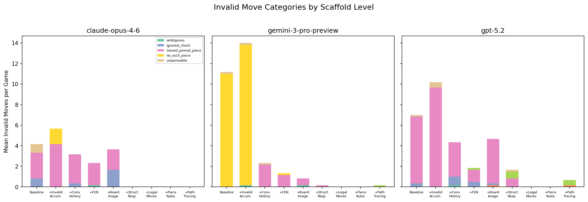
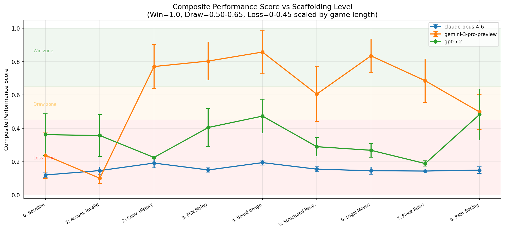
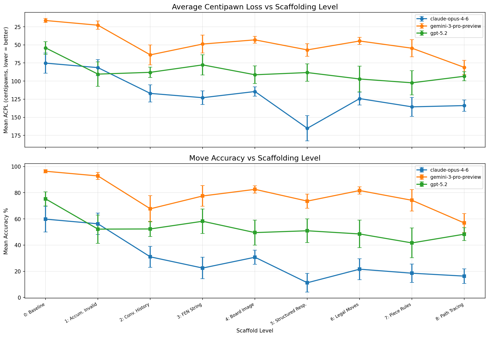
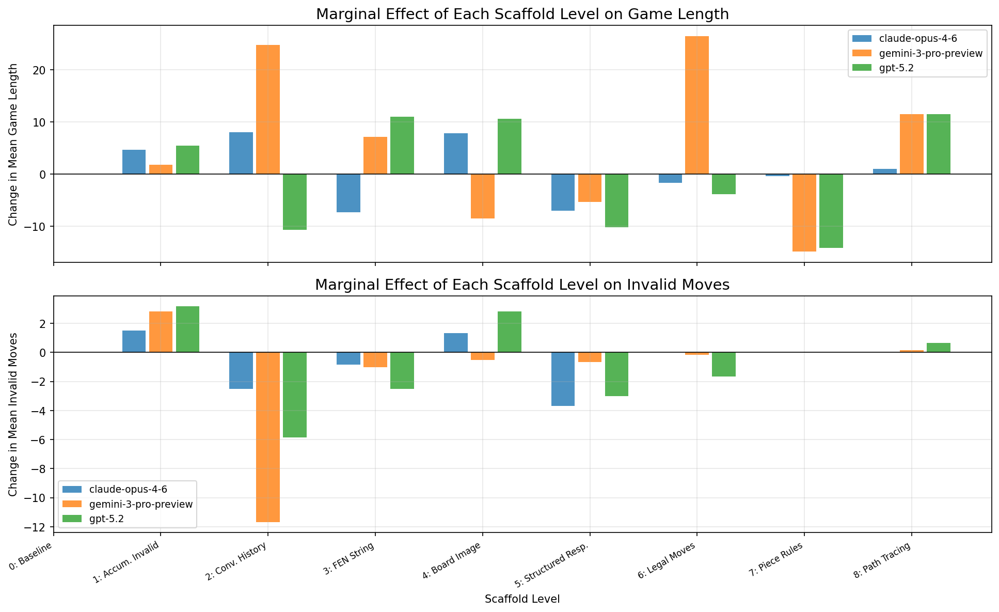

# How Good Are LLMs at Chess? A Scaffolding Ablation Study

---

## Motivation

- Chess is a **fully observable, deterministic** environment with unambiguous rules
- Provides a controlled testbed for **spatial reasoning**, **multi-hop inference**, and **world model maintenance**
- Key question: **How much of LLM chess failure is due to intrinsic spatial reasoning limits vs. fixable with scaffolding?**
- Relevant to AI safety: reasoning about constraints, planning under preconditions, and maintaining accurate world models are instrumentally useful capabilities

---

## Experimental Setup

| Parameter | Value |
|-----------|-------|
| **Models** | Claude Opus 4.6, Gemini 3 Pro Preview, GPT-5.2 |
| **Opponent** | Stockfish Skill Level 1, 100ms/move (~1418 Elo, 95% CI [1377-1459]) |
| **Colors** | Each model plays as both White and Black |
| **Epochs** | 3 per configuration |
| **Total games** | 162 (3 models x 9 levels x 2 colors x 3 epochs) |
| **Framework** | Inspect AI + python-chess + OpenRouter |

Note: 6 games per cell (model x level) is a small sample. Standard errors are reported for all metrics; many trends are suggestive rather than statistically conclusive.

---

## Scaffolding Levels (0-8)

Each level adds one feature on top of all lower levels:

| Level | Name | What it adds |
|-------|------|-------------|
| 0 | Baseline | Standalone prompt with PGN string only |
| 1 | +Invalid Accum. | Accumulated invalid-move list on retry |
| 2 | +Conv. History | Multi-turn conversation, Analysis + MOVE format |
| 3 | +FEN String | FEN position encoding each turn |
| 4 | +Board Image | Rendered board PNG (multimodal input) |
| 5 | +Structured Resp. | 5-part response: verify / threats / CCT / validate / move |
| 6 | +Legal Moves | Complete legal-move list each turn |
| 7 | +Piece Rules | Movement rules in system prompt |
| 8 | +Path Tracing | Explicit square-by-square path enumeration |

---

## Game Survival vs. Scaffolding

- Gemini 3 Pro: 16.0 +/- 1.5 moves (baseline) to 62.5 +/- 9.8 at level 6
- GPT-5.2: 45.2 +/- 8.9 to 61.7 +/- 6.6 at level 4
- Claude Opus 4.6: 21.3 +/- 2.8 to 34.5 +/- 2.6 at level 4
- Invalid moves drop to near-zero at levels 5-6 for all models
- Note: high variance within models (large SEs), especially at intermediate levels

---

## Win / Draw / Loss Rates

| Model | Overall Win Rate | Best Level |
|-------|-----------------|------------|
| Gemini 3 Pro | 25/54 (46.3%) | Level 4: 83.3% |
| GPT-5.2 | 6/54 (11.1%) | Level 8: 33.3% |
| Claude Opus 4.6 | 0/54 (0.0%) | -- |

Gemini 3 Pro was the only model to win consistently. Claude Opus 4.6 never won despite surviving longer with scaffolding, suggesting that **game length and strategic competence are related but distinct capabilities**. Caution: with only 6 games per cell, these win rates carry substantial uncertainty.

---

## The Primary Bottleneck: Move Legality

| Category | Count | What it means |
|----------|-------|---------------|
| **moved_pinned_piece** | 262 | Moves a piece that is pinned to the king |
| **no_such_piece** | 158 | References a piece on a square where none exists |
| **ignored_check** | 28 | Fails to address being in check |

At low scaffold levels, models produce strategically plausible but **mechanistically invalid** moves. Once invalid moves are eliminated (levels 5-6), the remaining bottleneck appears to shift to strategic depth, though our small sample size limits what we can conclude about strategic play.

---

## Example: Pin Detection Failure

Models often try to move pieces that are pinned to their king -- a multi-step relational reasoning failure:

> **Claude Opus 4.6**, Level 4 (playing White):
> "...I should capture the rook immediately with Nxd8, winning the exchange. After Nxd8, I'll have a rook, two bishops, and a knight vs Black's queen, bishop, knight - the material will be much closer and my pieces are very active around Black's exposed king."
> **MOVE: Nxd8**
>
> *System: "Your move 'Nxd8' was invalid (illegal in the current position)."*

The model's *strategic reasoning* is sound (capturing material, evaluating the resulting position), but it fails to notice the knight is pinned and cannot legally move. This pattern -- correct strategy, incorrect legality -- appeared 262 times across all models.

---

## Example: Confident but Wrong Spatial Reasoning

> **Gemini 3 Pro**, Level 2 (playing White, move 50):
> "My rook on f2 is pinned to the king on g1 by the rook on h6? No, the h6 rook pins the knight on h2 to the king on g1 via diagonal? No. The rook on h6 is on the h-file. King on g1 is on the g-file. So no pin."

The model attempts to reason about pin geometry explicitly -- and gets confused about whether the attack line exists. It correctly identifies the relevant pieces but **fails to resolve the spatial relationship** between them. This illustrates how verbal spatial reasoning can produce internally contradictory conclusions.

---

## Example: When It Works -- Gemini Delivers Mate

At higher scaffold levels, models sometimes demonstrate genuine tactical competence:

> **Gemini 3 Pro**, Level 5 (playing Black):
> "My Advantage: Mate in 1. My Queen on e3 and Bishop on d4 coordinate against the White King on h2. The square g1 is the weak point. The Bishop on d4 covers g1. The Queen on e3 can move to g1. King cannot capture Queen (covered by Bishop). King cannot move to g2 (occupied by Bishop). King cannot move to h3 (occupied by Pawn)."
> **MOVE: Qg1#**

This shows that with sufficient scaffolding, models can identify and verify checkmate patterns -- but this level of accuracy was inconsistent even at high scaffold levels.

---

## Composite Performance Score

**CPS formula**: Win = 1.0 | Draw = 0.5 + 0.15 * survival | Loss = 0.45 * survival

| Model | Baseline CPS | Best CPS | Best Level |
|-------|-------------|----------|------------|
| Gemini 3 Pro | 0.238 +/- 0.139 | 0.858 +/- 0.130 | Level 4 |
| GPT-5.2 | 0.362 +/- 0.125 | 0.482 +/- 0.153 | Level 8 |
| Claude Opus 4.6 | 0.120 +/- 0.016 | 0.194 +/- 0.015 | Level 4 |

CPS combines wins, draws, and survival into a single metric. Note the wide confidence intervals, particularly for Gemini and GPT-5.2, indicating high game-to-game variance.

---

## Move Quality: Centipawn Loss

| Model | Mean ACPL | Accuracy % |
|-------|-----------|------------|
| Gemini 3 Pro | 48 cp | 78.1% |
| GPT-5.2 | 87 cp | 53.0% |
| Claude Opus 4.6 | 119 cp | 29.8% |

ACPL measures per-move quality via Stockfish evaluation. Lower = better. For reference, a 1200-rated human typically averages ~150 cp. By this metric, Gemini 3 Pro plays at a level comparable to a moderately strong amateur, though this comparison should be treated cautiously since ACPL distributions differ between engines and humans.

---

## Diminishing Returns at High Scaffolding

- The largest gains come at levels 2-4 (conversation history, FEN, board image)
- Levels 7-8 show mixed or negative marginal returns for some models
- Possible explanations: information overload, conflicting instructions, or a shift from tactical to strategic bottleneck
- The inconsistent direction of marginal effects at high levels suggests these results may partly reflect noise given the small sample size

---

## AI Safety Implications

**1. Scaffolding as capability elicitation**
- Baseline to level 6 unlocks large performance gains, suggesting *unscaffolded benchmarks may underestimate model capability*
- However, the scaffolding-capability relationship is non-monotonic -- more scaffolding does not always help

**2. Scaffolding as a fragile dependency**
- Models that appear competent *with* scaffolding may be unreliable *without* it
- Relevant to robustness assessment in deployment

**3. Spatial reasoning as a capability probe**
- Pin detection failure (262 instances) = inability to reason about multi-hop relational constraints
- Suggestive analogy to: planning under preconditions, threat modeling, situational awareness
- Current LLMs appear to lack robust mechanisms for querying relational spatial structures

**4. Implications for sandbagging detection**
- Large scaffolding-dependent performance gaps are consistent with genuine capability limitations rather than strategic underperformance (though this is only one piece of evidence)

---

## Key Takeaways

1. **Scaffolding matters**: up to +46.5 mean moves and 83% win rate from near-zero baseline, though with high variance
2. **Move legality, not strategy, appears to be the primary bottleneck** at low scaffold levels
3. **Pin detection is a particularly difficult spatial reasoning primitive** -- 262 errors across all models
4. **Diminishing and sometimes negative returns** at the highest scaffold levels
5. **Large model differences**: Gemini 3 Pro >> GPT-5.2 >> Claude Opus 4.6 on this task, though we cannot fully rule out confounds (e.g., differences in chess-specific training data)
6. **Small sample caveat**: 6 games per cell means many results are suggestive rather than definitive

---

## Appendix: Additional Visualisations

| Figure | Description |
|--------|-------------|
| [fig3](fig3_color_comparison.png) | White vs Black performance asymmetry |
| [fig4](fig4_termination.png) | Game termination reasons by scaffold level |
| [fig5](fig5_heatmaps.png) | Model x scaffold level heatmaps |
| [fig7](fig7_distribution.png) | Game length distributions (box plots) |

All code, data, and figures available in this repository.
